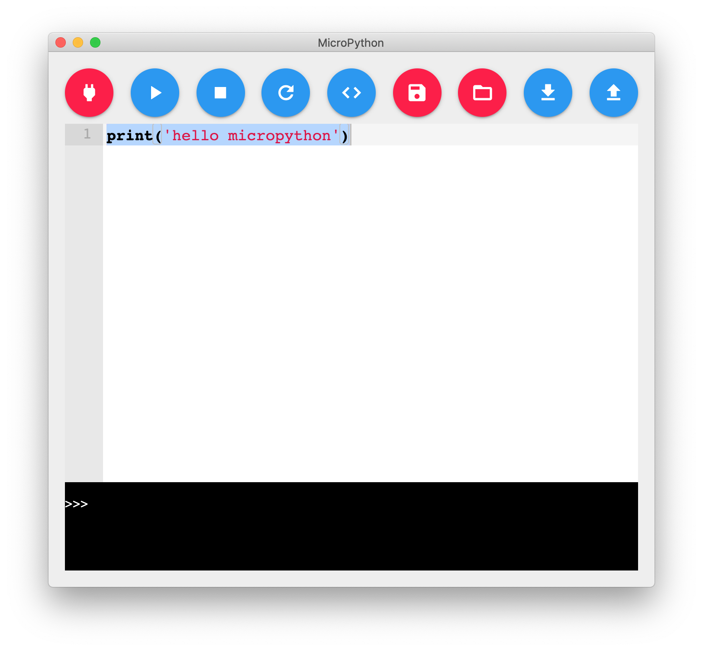
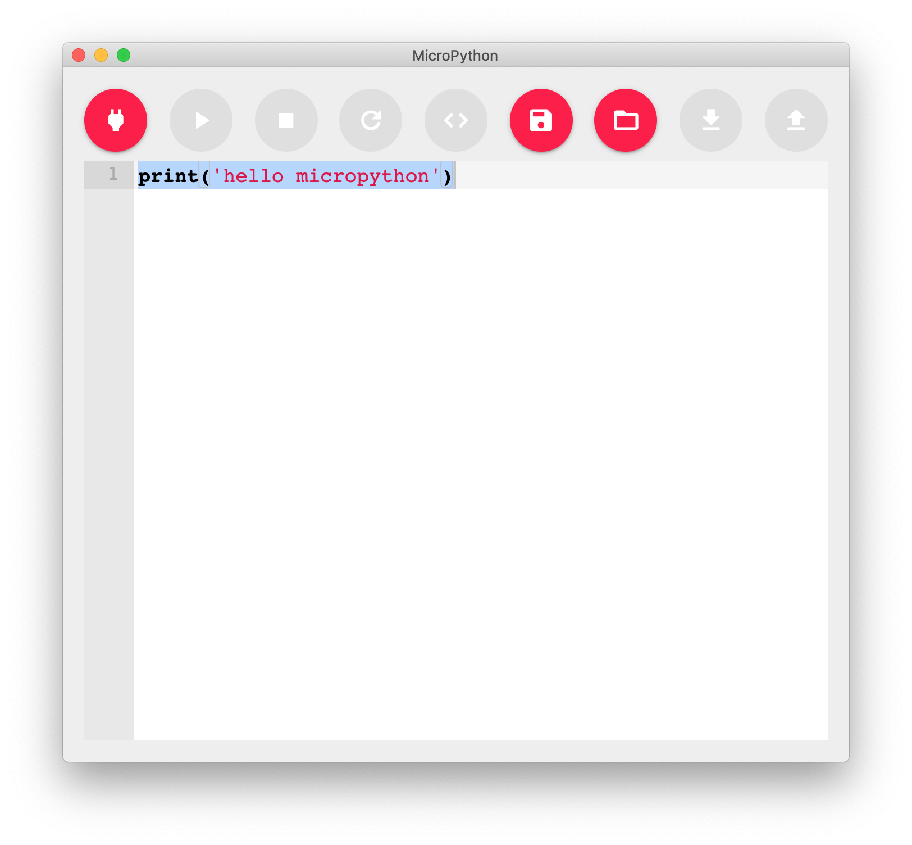
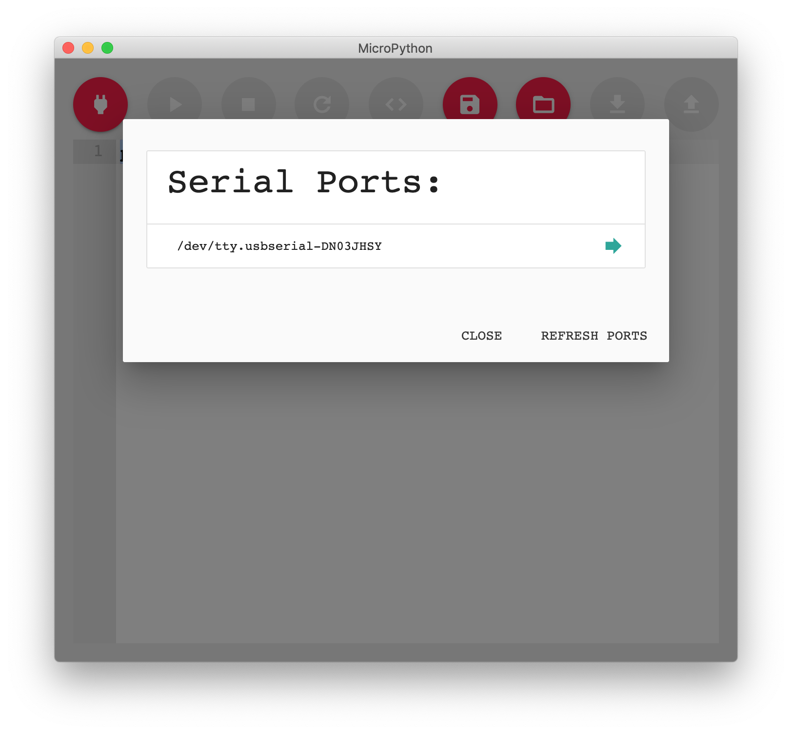
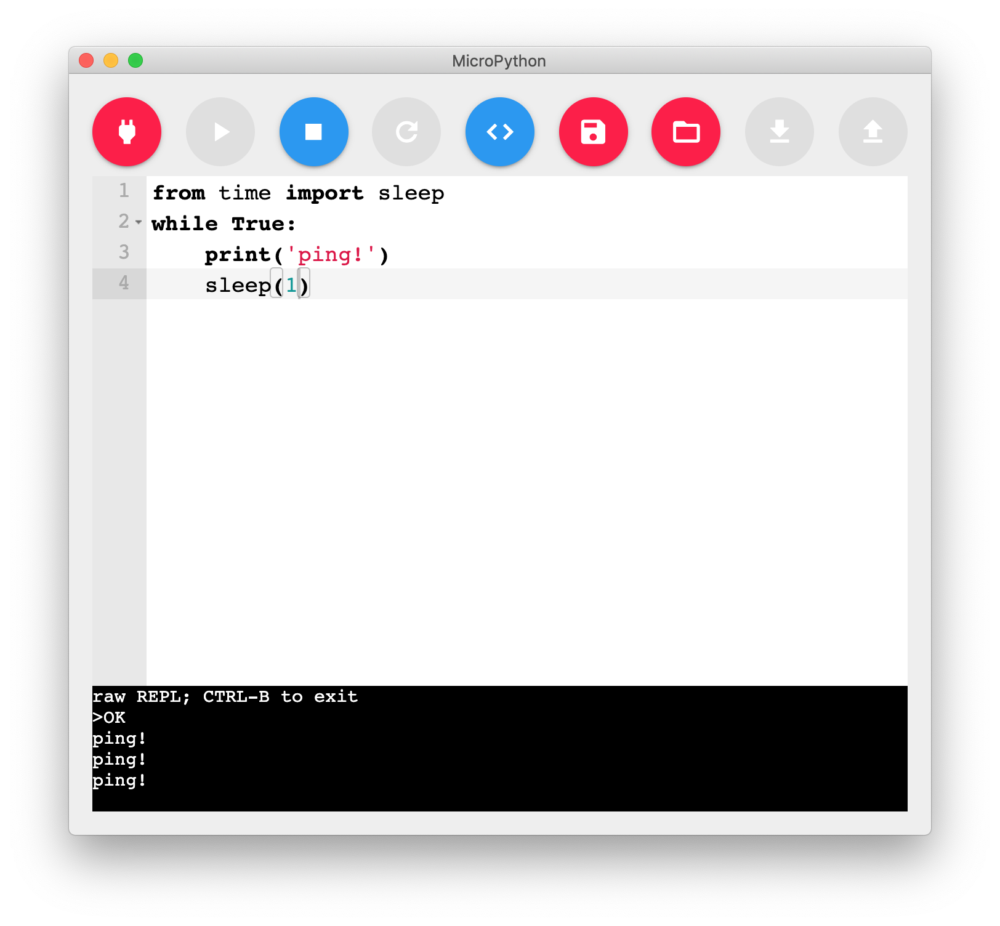
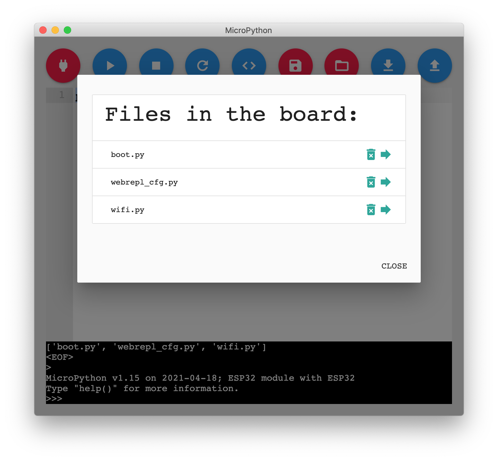
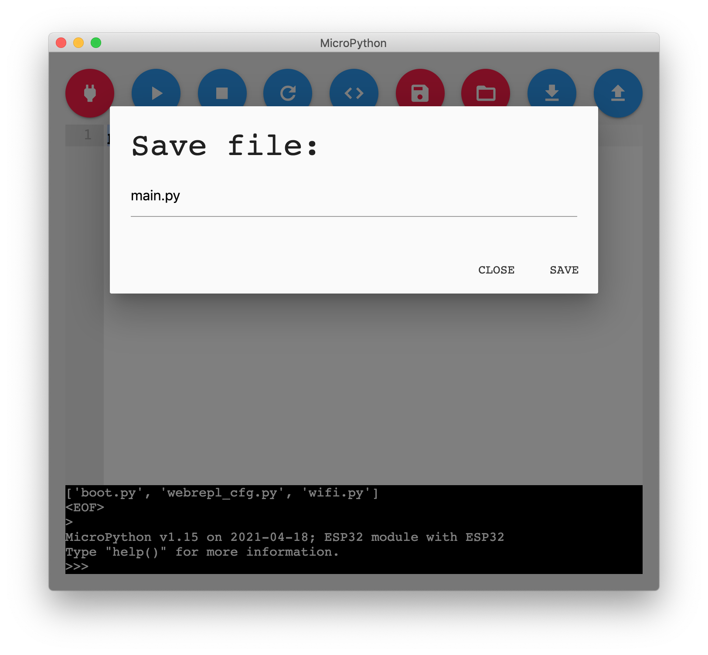

# Fabulous Flying Machine



A MicroPython IDE. Tested on following devices:

- ESP8266
- ESP32
- Micro:bit
- Arduino Nano RP2040 Connect (OpenMV MicroPython)

I draw much of the inspiration for this project from [Processing](https://processing.org) and [Mu Editor](https://codewith.mu/).


## Before starting
Make sure you have `nvm` or another Node Version Manager on your system.
To build on M1 you will need Node 14.18.2 and Electron ^8.0 (tested on 8.5.5).
The `package.json` is already setup to install requirements and run a post-install to take care of the correct version of Electron


## Running from source
1. `npm install`
1. `npm run dev`


## Building Electron App (Mac x64)
1. `nvm install 14`
1. `nvm use 14`
1. `npm install`
1. `npm run build`

## Where is what?

### UI

This is the interface source code. It follows the file structure:

```
ui/
  components/
  libs/
  store/
  index.html
  main.js
  main.css
```

Components are all UI elements and arrangements of elements. I'm using `lit-html` library for html templates and (smart) rendering.

Even though it has all dependencies listed on the `package.json` file, they are commited as part of the source code under the folder `libs`.

Store files are event handlers that change the state and/or talk with the `serialBus`.


### Electron back end

Electron backend consist in two files, `index.js` and `preload.js`.

- `index.js`: Creates Electron app window and core Electron properties.
- `preload.js`: Has access to the `window` object that will be available to the renderer process. This file is responsible for creating the `serialBus` and handling the events executing the correct serial functions.
- `micropython.js`: Interface between javascript and MicroPython's REPL via serial connection. This file is very much based on [WebREPL client](https://github.com/murilopolese/webrepl-client)

### Serial Bus

The front end will be able to communicate with the hardware serial over this nodejs `EventEmitter` instance that should live at `window.serialBus`.

The events the front end can emit are:
- `load-ports`: Request the list of available serial ports.
- `connect`: Connect to serial port. Called with a string argument `port`.
- `disconnect`: Close current connection.
- `run`: Enters RAW REPL mode, paste content, execute and leaves RAW REPL mode. Called with a string argument `code`.
- `stop`: Sends an interrupt to the board (`ctrl c` or `\r\x03`).
- `reset`: Resets board (`ctrl d` or `\r\x04`).
- `write`: Writes to serial. Called with a string argument `command`.

The events the back end emits are:
- `connected`: When connected to serial port
- `disconnected`: When disconnected to serial port
- `running`: When code is running
- `stopped`: When code is stopped
- `data`: When received data from serial
- `ports`: List all available serial ports. Called with array of serial ports.

## Screenshots

Disconnected:



Choosing a serial port to connect:



Connected:


Running code:



Listing, loading and removing files from MicroPython's file system:



Saving the current editor content as a file in MicroPython's file system:


